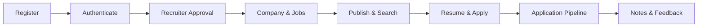
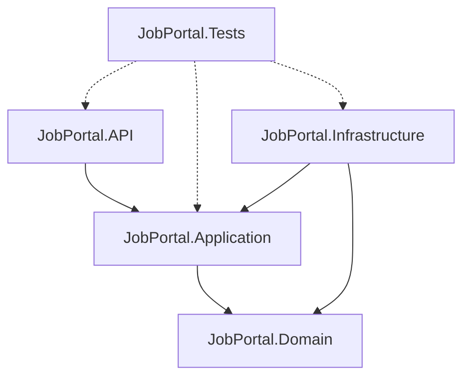
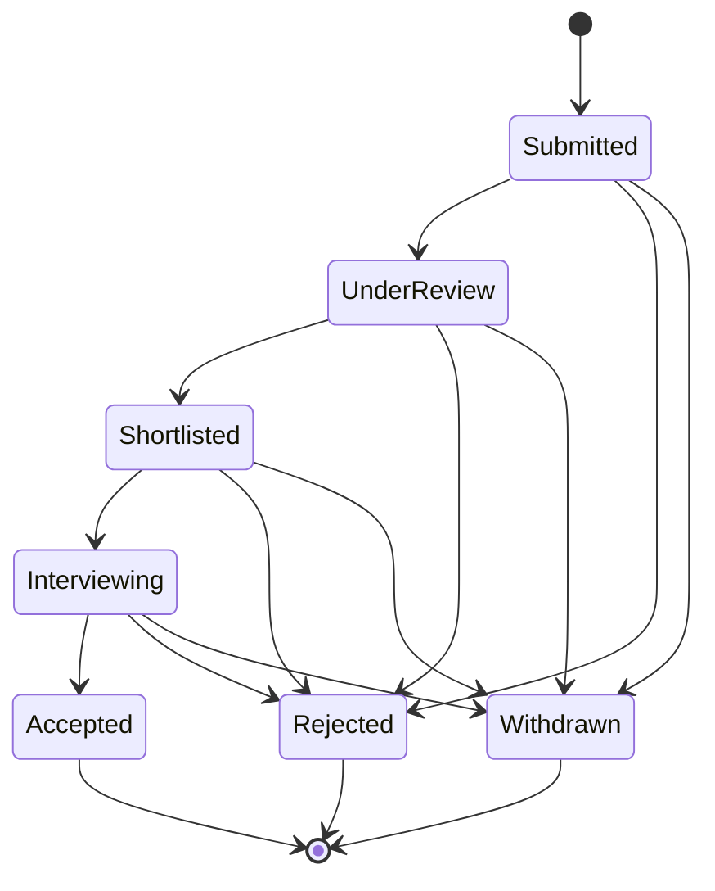
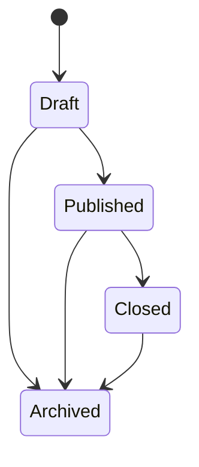
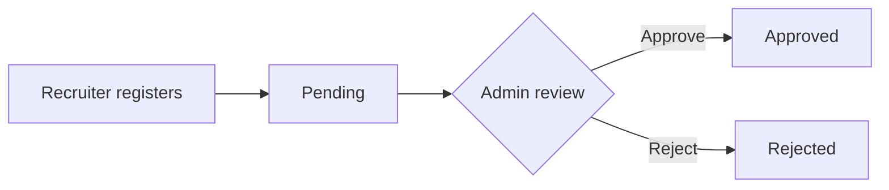
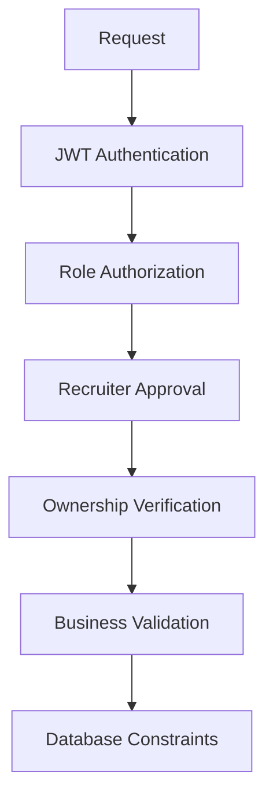

<div align="center">

# 💼 Job Portal Backend

**A production-oriented recruitment REST API built with ASP.NET Core 8 and Clean Architecture**


[Features](#-features) • [Architecture](#-architecture) • [Getting Started](#-getting-started) • [API Reference](#-api-reference) • [Security](#-security) • [Roadmap](#-roadmap)

</div>

---

## 📖 Overview

The **Job Portal Backend** is an API-only platform that connects **Job Seekers** and **Recruiters**, with an **Admin** role for recruiter approval. It covers the full hiring lifecycle: registration, secure authentication, company and job management, resume handling, applications, a recruiter pipeline, private notes, and structured candidate feedback.



> **Note:** This repository contains the backend only. No frontend is included.

---

## ✨ Features

### 🔐 Authentication & Authorization
- Separate registration for Job Seekers and Recruiters; no public Admin registration
- BCrypt password hashing (work factor **12**)
- JWT access tokens (**15 min**) with signature, issuer, audience, and expiry validation
- Refresh tokens with **rotation**, **revocation**, **reuse detection**, and logout invalidation
- Role-based authorization (`JobSeeker`, `Recruiter`, `Admin`)
- Admin-driven **recruiter approval** workflow (`Pending → Approved / Rejected`)
- Rate limiting on authentication endpoints

### 🏢 Companies & Jobs
- Recruiter-owned company management
- Job CRUD with validation and skills (many-to-many)
- Controlled job lifecycle: `Draft → Published → Closed → Archived` (plus `Draft → Archived`, `Published → Archived`)
- Public job search with keyword, location, job type, and skills filters, sorting, pagination, and expiry handling

### 📄 Resumes
- Upload **PDF / DOC / DOCX**, up to **5 MB**
- Server-generated GUID filenames and path traversal protection
- Streamed downloads that never expose server paths
- Multiple resumes per user with a single enforced default (partial unique index)
- Storage abstraction via `IFileStorageService` (local today, cloud-ready)

### 📨 Applications & Pipeline
- Apply with an optional cover letter (max 5000 characters)
- Eligibility checks: no applying to closed, archived, expired, or unpublished jobs
- Duplicate prevention at service level and database level
- Application state machine: `Submitted → UnderReview → Shortlisted → Interviewing → Accepted`, with `Rejected` and `Withdrawn` as alternate terminal outcomes
- Job Seeker history, filtering, and withdrawal; recruiter pipeline per job

### 📝 Recruiter Evaluation
- **Private notes** with full CRUD and deterministic pagination (`CreatedAt DESC, Id DESC`)
- **Structured candidate feedback**: rating (1–5), strengths, weaknesses, detailed feedback, and recommendation (`StrongHire`, `Hire`, `Maybe`, `NoHire`, `StrongNoHire`)
- One feedback record per recruiter per application (`409 Conflict` on duplicates)
- Feedback is **advisory only** and never changes application status automatically

### 🛠 Platform
- Global exception handling with RFC 7807 ProblemDetails responses
- Serilog structured logging with sensitive data excluded
- Health checks, Swagger/OpenAPI, CORS, security headers, and correlation IDs
- Dockerized with a multi-stage build

---

## 🧰 Tech Stack

| Area | Technology |
|---|---|
| Language / Runtime | C#, .NET 8 |
| Framework | ASP.NET Core 8 Web API |
| Database | PostgreSQL (Neon), Npgsql |
| ORM | Entity Framework Core 8 |
| Auth | JWT Bearer, BCrypt, Refresh Token Rotation |
| Validation | FluentValidation |
| Logging | Serilog |
| Docs | Swagger / OpenAPI |
| Testing | xUnit |
| Containers | Docker (multi-stage) |

---

## 🏗 Architecture

The solution follows **Clean Architecture** with strict dependency direction.



| Layer | Responsibility |
|---|---|
| **Domain** | Entities, enums, core business concepts |
| **Application** | Services, DTOs, interfaces, validators, workflows |
| **Infrastructure** | EF Core, configurations, migrations, file storage, auth infrastructure |
| **API** | Controllers, middleware, configuration, HTTP concerns |
| **Tests** | Unit and infrastructure tests, test helpers |

<details>
<summary><b>📁 Project structure</b></summary>

```text
JobPortal/
├── JobPortal.sln
├── JobPortal.API/
│   ├── Controllers/  Configuration/  Middleware/  Extensions/
│   ├── Program.cs
│   └── appsettings.json / appsettings.Development.json
├── JobPortal.Application/
│   └── DTOs/  Interfaces/  Services/  Validators/  Common/
├── JobPortal.Domain/
│   └── Entities/  Enums/  Common/
├── JobPortal.Infrastructure/
│   └── Data/  Configurations/  Services/  Migrations/  Extensions/
├── JobPortal.Tests/
│   └── Unit/  Infrastructure/  TestHelpers/
├── Dockerfile
├── docker-compose.yml
├── .env.example
└── README.md
```
</details>

### Domain Entities

`User` · `Role` · `JobSeeker` · `Recruiter` · `Company` · `Job` · `Skill` · `JobSkill` · `Resume` · `Application` · `RefreshToken` · `RecruiterNote` · `CandidateFeedback`

---

## 🚀 Getting Started

### Prerequisites

- [.NET 8 SDK](https://dotnet.microsoft.com/download/dotnet/8.0)
- A PostgreSQL database ([Neon](https://neon.tech) recommended, SSL required)
- [Docker](https://www.docker.com/) (optional)
- `dotnet-ef` tool for migrations: `dotnet tool install --global dotnet-ef`

### 1. Clone

```bash
git clone <your-repository-url>
cd JobPortal
```

### 2. Configure environment

Copy the example file and fill in real values. **Never commit `.env`.**

```bash
cp .env.example .env
```

```env
ConnectionStrings__DefaultConnection=

Jwt__SecretKey=
Jwt__Issuer=
Jwt__Audience=
Jwt__AccessTokenExpirationMinutes=15
Jwt__RefreshTokenExpirationDays=7

FileStorage__ResumeStoragePath=uploads/resumes
FileStorage__ResumeMaxSizeBytes=5242880
```

### 3. Apply migrations

```bash
dotnet ef database update --project JobPortal.Infrastructure --startup-project JobPortal.API
```

### 4. Run the API

```bash
dotnet run --project JobPortal.API
```

Swagger UI is available in development at `/swagger`.

### Run with Docker

```bash
docker compose up --build
```

Secrets are supplied through environment variables and are never baked into the image.

### Development commands

| Command | Purpose |
|---|---|
| `dotnet restore` | Restore dependencies |
| `dotnet build --no-incremental` | Clean build |
| `dotnet test` | Run the test suite |
| `dotnet format --verify-no-changes` | Verify formatting |
| `dotnet ef migrations list` | List EF migrations |

---

## 📡 API Reference

Base path: `/api/v1`. Interactive documentation is available via Swagger.

<details open>
<summary><b>Authentication</b></summary>

| Method | Endpoint | Description |
|---|---|---|
| POST | `/auth/register/jobseeker` | Register a Job Seeker |
| POST | `/auth/register/recruiter` | Register a Recruiter (pending approval) |
| POST | `/auth/login` | Login, returns access and refresh tokens |
| GET | `/auth/me` | Current user from JWT |

Refresh, logout, and change-password endpoints are also provided.
</details>

<details>
<summary><b>Resumes (Job Seeker)</b></summary>

| Method | Endpoint | Description |
|---|---|---|
| POST | `/jobseeker/resumes` | Upload a resume |
| GET | `/jobseeker/resumes` | List resumes |
| GET | `/jobseeker/resumes/{resumeId}` | Get resume details |
| GET | `/jobseeker/resumes/{resumeId}/download` | Download resume |
| PATCH | `/jobseeker/resumes/{resumeId}/default` | Set default resume |
| DELETE | `/jobseeker/resumes/{resumeId}` | Delete resume |
</details>

<details>
<summary><b>Applications (Job Seeker)</b></summary>

| Method | Endpoint | Description |
|---|---|---|
| POST | `/jobs/{jobId}/apply` | Apply to a job |
| GET | `/jobseeker/applications` | Application history (filter, paginate) |
| GET | `/jobseeker/applications/{applicationId}` | Application details |
| PATCH | `/jobseeker/applications/{applicationId}/withdraw` | Withdraw application |
</details>

<details>
<summary><b>Recruiter Pipeline</b></summary>

| Method | Endpoint | Description |
|---|---|---|
| GET | `/recruiter/jobs/{jobId}/applications` | Applications for an owned job |
| GET | `/recruiter/applications/{applicationId}` | Application details |
| GET | `/recruiter/applications/{applicationId}/resume` | Download candidate resume |
| PATCH | `/recruiter/applications/{applicationId}/status` | Update application status |
</details>

<details>
<summary><b>Recruiter Notes</b></summary>

| Method | Endpoint | Description |
|---|---|---|
| POST | `/recruiter/applications/{applicationId}/notes` | Create note |
| GET | `/recruiter/applications/{applicationId}/notes` | List notes (paginated) |
| GET | `/recruiter/applications/{applicationId}/notes/{noteId}` | Get note |
| PUT | `/recruiter/applications/{applicationId}/notes/{noteId}` | Update note |
| DELETE | `/recruiter/applications/{applicationId}/notes/{noteId}` | Delete note |
</details>

<details>
<summary><b>Candidate Feedback</b></summary>

| Method | Endpoint | Description |
|---|---|---|
| POST | `/recruiter/applications/{applicationId}/feedback` | Create feedback |
| GET | `/recruiter/applications/{applicationId}/feedback` | Get feedback |
| PUT | `/recruiter/applications/{applicationId}/feedback` | Update feedback |
| DELETE | `/recruiter/applications/{applicationId}/feedback` | Delete feedback |
</details>

<details>
<summary><b>Health</b></summary>

| Method | Endpoint | Description |
|---|---|---|
| GET | `/api/v1/health` | API health |
| GET | `/health` | Liveness |
| GET | `/health/ready` | Readiness (includes database) |
</details>

### HTTP status codes

| Code | Meaning |
|---|---|
| `400` | Validation or bad request |
| `401` | Unauthenticated |
| `403` | Forbidden (wrong role or unapproved recruiter) |
| `404` | Resource not found |
| `409` | Conflict (for example, duplicate feedback) |
| `500` | Unexpected server error |

---

## 🔄 Workflows

### Application state machine



> Exact rejection and withdrawal transitions follow the implemented transition rules. Invalid transitions are rejected.

### Job lifecycle



### Recruiter approval



---

## 🛡 Security

Security is enforced in layers, from the request through to the database.



**Ownership chain (multi-tenant isolation)**

```text
JWT UserId → Recruiter → Owned Company → Owned Job → Application → Resume / Notes / Feedback
```

- **IDOR protection:** identity always comes from JWT claims, never from request bodies.
- **Secrets:** environment-driven configuration, `.env` excluded from Git, credentials never logged.
- **Files:** extension, content type, and size validation; GUID filenames; path traversal protection.
- **Logging:** passwords, tokens, database credentials, resume contents, private notes, and feedback are never logged.
- **Errors:** ProblemDetails responses without stack traces, secrets, or internal paths.

---

## 🗄 Database

PostgreSQL on **Neon** (SSL required), managed with EF Core migrations. The existing migration chain was preserved during the move from local PostgreSQL to Neon.

### Key constraints

| Table | Constraint |
|---|---|
| `Users` | `UNIQUE(Email)` |
| `RefreshTokens` | `UNIQUE(Token)` |
| `JobSkills` | `UNIQUE(JobId, SkillId)` |
| `Applications` | `UNIQUE(JobId, JobSeekerId)` |
| `CandidateFeedbacks` | `UNIQUE(ApplicationId, RecruiterId)` |
| `Resumes` | Partial unique index: one default per Job Seeker |

Historical relationships (notes and feedback to applications and recruiters) use `DeleteBehavior.Restrict` to prevent accidental cascade deletion.

<details>
<summary><b>Migration history</b></summary>

```text
20260929040654_InitialCreate
20260929042502_Phase2Authentication
20260929050925_Phase3CompanyJobManagement
20260929053654_Phase4ResumeAndApplications
20260929093559_Phase5RecruiterNotesAndCandidateFeedback
```
</details>

---

## ✅ Quality & Testing

| Metric | Result |
|---|---|
| Total tests | 194 |
| Passed | 194 |
| Failed | 0 |
| Skipped | 0 |
| Build errors / warnings | 0 / 0 |

```bash
dotnet test
dotnet build --no-incremental
dotnet format --verify-no-changes
```

Regression coverage spans Phase 1 through Phase 5 and the Neon migration. Test environments must never target the production Neon database.

---

## 🗺 Roadmap

| Phase | Status |
|---|---|
| Phase 1: Foundation | ✅ Complete |
| Phase 2: Authentication & Authorization | ✅ Complete |
| Phase 3: Company & Job Management | ✅ Complete |
| Phase 4: Resume & Applications | ✅ Complete |
| Neon PostgreSQL Migration | ✅ Complete |
| Phase 5: Recruiter Notes & Feedback | ✅ Complete |
| Phase 6: Notifications (email, in-app, background processing) | 🔜 Planned |
| Interview Scheduling | 🔜 Planned |
| Cloud Storage (S3, Azure Blob, GCS) via `IFileStorageService` | 🔜 Planned |

### Current limitations

Not included in the Phase 1–5 scope: frontend, email or in-app notifications, interview scheduling, cloud object storage, AI resume parsing or scoring, payments, real-time chat, and message brokers.

---

## 🧭 Design Principles

- **Separation of concerns:** each layer has one responsibility
- **Security by ownership:** resources resolve through the authenticated user's chain
- **Defense in depth:** rules enforced in both application and database
- **Explicit state machines:** jobs and applications change state only through valid transitions
- **Environment-based configuration:** no hardcoded secrets
- **Extensibility:** infrastructure sits behind interfaces

---

<div align="center">

**Built with ASP.NET Core 8 · Clean Architecture · PostgreSQL**

</div>
